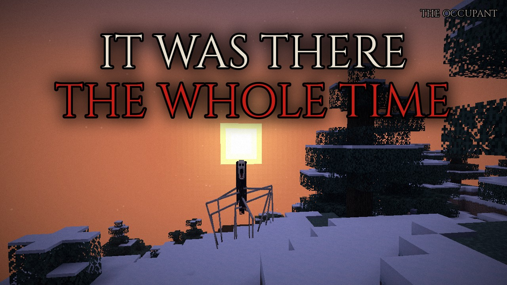

# The Occupant: Creator Pack

Everything you need to make a video of The Occupant, in one place.

**The short version:** install it, pick **CREATOR CUT** when you create the world, play at
night with headphones, and don't go looking for it. You get the whole story, ending included,
in about forty minutes.

---

## 1. Start a Creator Cut world

1. Install [Fabric Loader](https://fabricmc.net/use/), [Fabric API](https://modrinth.com/mod/fabric-api),
   and the Occupant jar for your Minecraft version (see the [README](../README.md#install)).
2. Start the game. The title screen is the mod's own; under the way in there are two choices:
   - **CREATE WORLD**: the slow burn, paced for a long evening (or several).
   - **CREATOR CUT** *(recommended for recording)*: the same story, made for a video. About
     forty minutes, the ending included.
3. Pick **CREATOR CUT**. You go straight into a new survival world.

That's it. The mode is saved with the world, so you can stop and carry on in another session.
Already have a world? `/occupant creator on` (with cheats on, or as an operator) turns it on for
that world; `/occupant check` tells you which mode a world is in.

### What the Creator Cut changes

| | Slow burn | Creator Cut |
|---|---|---|
| Quiet start | 3 minutes | 1½ minutes |
| Each act | as long as it takes | about half as long |
| Things happening | every minute or three | more often |
| Calm after a big moment | long | shorter, and a long quiet brings the next thing sooner |
| Between the big moments | 20 minutes or more | about 9 minutes |
| The last night | when you have earned it | always reached, a few minutes into the last act |

Nothing is *added*: the Creator Cut only cuts the waiting. Every scare still has to find a
convincing place to happen, or it doesn't happen.

## 2. What to expect (and when)

Roughly. It reacts to what you do, so no two videos go the same way, which is the point.

| Time | Act | What it's like |
|---|---|---|
| 0:00 | – | Black screen, one line: *there is something in this world with you.* Then nothing. Build, explore, get comfortable. |
| ~1:30 | **1. Signs** | Deniable things. Footsteps that stop when you do. A sound from somewhere it can't be. Something at the very edge of the fog you can't quite make out. |
| ~6–9 | **2. Presence** | It's closer and not hiding as well. A face at the window. Knocking. The animals all stop and stare at the same spot. A sign you didn't place. |
| ~12–18 | **3. Closer** | It follows you, moving only when you aren't looking. Chat says things you didn't type. It's by your bed when you get home. |
| ~20–25 | **4. Hunt** | The music drops away. It's out there, looking at you. Then it runs. |
| ~25–40 | **The last night** | Out in the open, at night: the fog closes right in, and every time you look away it is closer. |

There are **three endings**, depending on how you played it. The survivor's log (pages turn up
in chests and barrels in the old places) eventually tells you where their last camp is. Find
it before the last night and the ending is different. Hide indoors the whole time and it is
different again.

**Tips for the story to land:**

- **Play in survival.** It leaves creative players alone.
- **Go outside at night**, at least sometimes. The best moments need the dark and some open
  ground. If you're in a hurry for the last night, `/time set night` is fair game.
- **Explore.** The houses, the abandoned villages, ruined keeps, camps, chapels, watchtowers,
  radio shacks, lighthouses... and its lair. Read the pages you find out loud.
- **Don't fight it.** It can't be hurt. Hit it and it's simply gone.
- **If nothing seems to be happening**, `/occupant check` tells you why (too bright, not alone,
  still in the quiet start...). It only tells you; nothing in the world changes.

## 3. Recording setup

- **Headphones and sound up.** Most of it is heard before it's seen, and directionally. Your
  audience needs to hear it too: don't duck the game audio under your voice too much.
- **Music volume on.** The mod has its own score, mixed live under the game's *Music* slider.
  It goes silent on purpose at the worst moments.
- **Brightness at Moody (0%).** The dark is the whole game. It has a faint sheen that keeps it
  just visible in real darkness, so your viewers will still see it.
- **Render distance 8 or more.** The fog covers the edge, so the mod looks the same whatever
  your render distance, but it needs about eight chunks to stand at the edge of.
- **Shaders** work (it draws like any other mob), but most shader packs draw their own fog
  instead of the game's, so you lose the mod's fog. Try it without first.
- **Photosensitive viewers:** set `reduceFlashing` to `true` (Options → The Occupant, or
  `config/occupant-client.json`). Every hard flash and flicker becomes a slow fade.
- **Streaming?** Nothing in the mod reads your chat or does anything your viewers can trigger.
  It only knows your in-game name.

## 4. B-roll and pickup shots

Need a clean shot after the fact, for the intro, the thumbnail or a re-take? Turn cheats on
(or open to LAN with cheats), then:

```
/occupant here 60                      put it sixty blocks in front of you, right now
/occupant here 20                      ...or twenty. It never refuses this one
/occupant act @s 4                     jump to the last act
/occupant trigger @s watcher           it watches you from somewhere dark
/occupant trigger @s window            a face at the window (be inside, at night)
/occupant trigger @s last_night        the ending (outside, at night, act 4)
/occupant stop @s                      end whatever is happening
/occupant pause @s                     stop the story while you set something up
/occupant resume @s
```

`/occupant trigger` still needs a convincing place: if it says it couldn't find one, go
somewhere darker or with a longer view. That's on purpose.

**Good shots:** F1 to hide the HUD; the fog at dusk with it standing at the edge; a long
corridor in a cave; the side hallway of the house (the first time you go in, it's standing in
it); the chapel, with the one pew turned round to face the door.

## 5. Thumbnails, titles and art

Ready-made, free to use, all from real frames of the game:

- **[`creators/thumbnails/`](creators/thumbnails)**: 1280 × 720 YouTube thumbnails with big words.
- **[`creators/blank/`](creators/blank)**: the same, without words: put your own face and text on them.
- **[`creators/vertical/`](creators/vertical)**: 1080 × 1920 covers for Shorts, TikTok and Reels.
- **[`modrinth/gallery/`](modrinth/gallery)** and **[`modrinth/stills/`](modrinth/stills)**:
  graded, letterboxed stills, and the untouched frames, if you'd rather grade your own.



You're very welcome to take your own screenshots, edit them, or make something new.
(`tools/marketing/make_creator_kit.py` re-makes these from any frames you drop into
`docs/modrinth/stills/`.)

**Title ideas** (use them, change them, ignore them):

- *Something Is Living In My Minecraft World*
- *This Minecraft Mod Learns How To Be You*
- *I Was Never Alone In This World*
- *It Was Standing There The Whole Time*
- *Minecraft's Scariest Mod Doesn't Have Jumpscares*
- *Don't Look At It*

## 6. Credit

Not required, but appreciated. Something like this in the description:

> Mod: **The Occupant** (Fabric), by Wolfsmask: <link to the mod page>

You can monetise your videos. You don't need to ask. If you make something with it, we'd love
to see it.

## 7. Things that are good to know

- **Only you can see it.** If you play with a friend, they don't see or hear what you do
  (unless it's haunting them too). Great for a duo video: one of you sees it, the other
  doesn't.
- **On a server**, every player gets their own story. Visual moments wait until you're alone.
- **Not too much?** `intensity` in `config/occupant.json` can be `subtle`, `normal` or
  `relentless`, and `soundOnly` makes it never be seen, only heard.
- **It never breaks your world.** It never digs into anything but natural stone, never removes
  torches near your bed, never saves itself to disk, and every scare is undone if anything goes
  wrong. Your world is safe to keep playing after the video.
- **Versions:** 1.20.1, 1.21.1, 1.21.11, 26.1.x, 26.2, 26.3 and the 26.4 snapshot, all Fabric.
